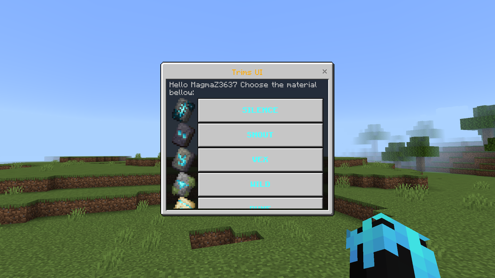

# 🧥 MTrims 🎉
***
**MTrims. Pocketmine Plugin Can Add Trims To Your Server**

## 🔰 SPOILER
***

## 💾 INSTALLATION
***
1. Download `latest` MTrims
2. Place MTrims file into `plugins` directory
3. Restart The Server

### ❗ VIRION DEPEND
***
[LibTrimArmor](https://github.com/KRUNCHSHooT/LibTrimArmor)

### 🎮 COMMAND AND PERMISSION
***

| Command   | Permission | Aliases       |
|-----------|------------|---------------|
| `trimsui` |    `trim.use`        | `trims / tui` |

## 📃 LICENCE
***
[Apache Licence 2.0](https://github.com/MagmaZ3637/MTrims?tab=Apache-2.0-1-ov-file#)
